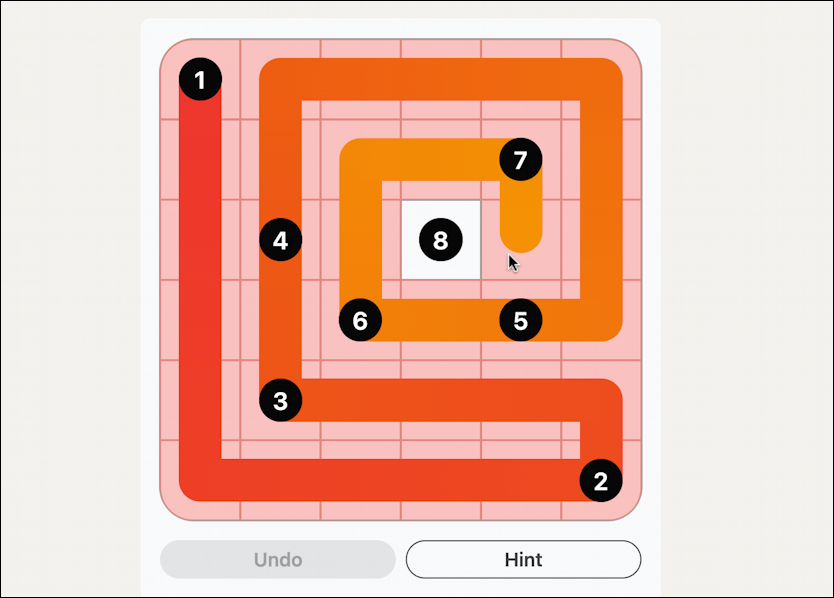

# OOP2 Test - Zip Game Puzzle



## **Zip Game** คือเกมปริศนาที่เราต้องเชื่อมจุดที่มีหมายเลข 1-8 ให้ถูกต้องตามลำดับ โดยมีเงื่อนไขดังนี้

1. เชื่อมจุดตามลำดับ: **1 → 2 → 3 → 4 → 5 → 6 → 7 → 8**
2. เส้นทางต้องผ่าน**ทุกช่อง**บนกระดาน (ไม่มีช่องว่าง)
3. เส้นทางต้องไม่ทับซ้อนกัน
4. เดินได้แค่ 4 ทิศทาง: ขึ้น, ลง, ซ้าย, ขวา (ไม่เดินทแยง)

### ตัวอย่างจากรูป (`image.png`):

ดูที่รูป `image.png` จะเห็นว่า:
- มีกระดานสี่เหลี่ยมสีชมพู
- มีจุดหมายเลข 1-8 กระจายอยู่บนกระดาน
- เส้นสีแดง-ส้มเชื่อมจุดต่างๆ เข้าด้วยกันแบบงู
- เส้นทางผ่านทุกช่องบนกระดาน ไม่มีช่องว่าง!

---


### 1. คลาส `Cell`
```cpp
class Cell {
    bool visited;       // บันทึกว่าผ่านช่องนี้แล้วหรือยัง
    int checkpoint;     // เก็บหมายเลข 1-8 (ถ้ามี)
    ...
}
```
- เป็นช่องเล็กๆ บนกระดาน
- เก็บข้อมูลว่าช่องนี้ผ่านแล้วหรือยัง (`visited`)
- เก็บว่าเป็นจุดหมายเลขเท่าไหร่ (เช่น 1, 2, ..., 8)

### 2. คลาส `Grid`
```cpp
class Grid {
    vector<vector<Cell>> cells;  // เก็บช่องทั้งหมด
    ...
}
```
- เป็นกระดานเกมทั้งหมด (เช่น 8x8)
- จัดการช่องทั้งหมดบนกระดาน
- ตรวจสอบว่าจะเดินไปช่องนั้นได้หรือไม่

### 3. คลาส `ZipGame` 
```cpp
class ZipGame {
    Grid grid;
    bool backtrack(int r, int c, int checkpoint) {
        // ใช้ Backtracking หาเส้นทาง
    }
}
```
- เป็นตัวแก้ปัญหาหลัก
- ใช้วิธี **Backtracking** (ลองผิดลองถูก) หาเส้นทาง
- ถ้าเจอทางตัน ก็ถอยกลับมาลองทางใหม่

---

## วิธีรันโปรแกรม

### สำหรับ C++:

```bash
# 1. Compile (แปลภาษา)
g++ -std=c++11 -o zip_game Quiz_ZIP_GAME.cpp

# 2. Run (รันโปรแกรม)
./zip_game
```